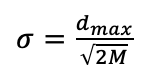
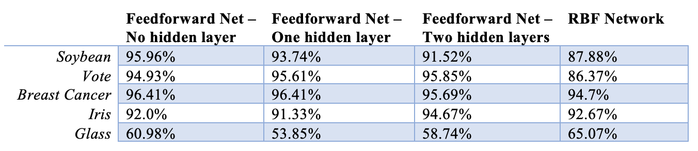

# Feedforward-Neural-Networks-vs-RBF-Network

## Abstract

In this project, two algorithms – Feedforward Neural Network and Radial Basis Function Network – are experimented to solve classification problems for 5 datasets in the UCI Machine Learning Repository [1]. Both algorithms have very good performances on 4 out of the 5 datasets yet both fail to perform well on one specific dataset. We assess how the algorithms handle each problem and discuss some possible explanations behind their behaviors.

## Introduction

The main problems in this project are classification problems based on 5 datasets – “Breast Cancer”, “Glass”, “Iris”, “Soybean”, and “Vote”. Of the 5 datasets, “Vote” and “Breast Cancer” have 2 classes, whereas others have multiple classes. Also, “Vote” is the only dataset whose attributes are all Boolean attributes. Other datasets have either categorical, continuous, or mixed attributes.

> Three types of Feedforward Networks are implemented: Single-layer Perceptron (SLP), Multi-layer Perceptron (MLP) with 1 hidden layer, and Multi-layer Perceptron with 2 hidden layers. In an SLP model, the output layer is directly connected to the input layer. That is, the net output (output before applying the activation function) of an output node is a linear combination of the weight vector and the feature vector. As a result, the SLP algorithm is only able to learn linearly separable patterns. On the other hand, with nonlinear activation functions in the hidden layer(s), MLPs are capable of solving nonlinearly separable problems. Note that it has been shown that an MLP with 1 hidden layer is already a “universal approximator” that can learn any nonlinear function [2]. Adding a second hidden layer introduces additional complexity which allows the model to learn more complex patterns. Thus, for datasets that are linearly separable, I expect SLP to perform better. Yet for datasets that are not linearly separable, I expect MLPs to shine. 2 hidden layers of complexity should be helpful in cases where there exist complex patterns.

> On the other hand, Radial Basis Function Network (RBF Network) has 1 hidden layer. Using radial basis functions at the hidden layer, the resulting model is also a “universal approximator”. Thus, similar to Multi-layer Perceptrons, I expect RBF Network to have good performance on nonlinearly separable problems. Note that RBF Network relies on distance measurement when calculating outputs for radial basis functions, so it suffers more from the curse of dimensionality. Also, due the use of local activation functions, neurons in an RBF Network are more locally sensitive than that in a Feedforward Network. This characteristic makes RBF Network better against noise in the training set, but reduces its ability to extrapolate [3]. Thus, I expect RBF Network to be more robust to noise, but expect Feedforward Network to perform better in general cases, especially when the training set is small.

## Methods

- Data processing:
  
  All datasets used in this project expect for the “Vote” dataset contain only numeric attributes. Note that it has been reported that Feedforward Network benefits from normalization [4]. Being a distance-based method, RBF network is sensitive to different attribute units, and therefore it also benefits from normalization. Thus, all numeric attributes are normalized to be in the range [0, 1].

  Missing values are filled with class vote or class median: If the attribute is Boolean or nominal categorical, the missing value is filled with the majority vote value from the data points that belong to the same class. If the attribute is ordinal categorical or continuous, the missing value is filled with the median value of the data points that belong to the same class.

- Feedforward Network [5]:

  Backpropagation is used for training Multi-layer Perceptrons. Sigmoid function is used as the activation function at the hidden layer(s) and the output layer. Initial weights at each level are set in the range [-0.01, 0.01]. There are two stopping criteria for the training process: training either stops when a pre-specified performance threshold is reached, or when it has gone through a pre-specified number of iterations. Performance is measured by classification accuracy. During each iteration, all instances in the training set are presented to the model in a random order. Each instance would cause a corresponding change in the weights. 

  Each output node represents a class, so the number of output nodes equals the number of classes. For prediction, the output node that has the highest sigmoid output is selected and the class it represents is assigned as the predicted class. Different number of hidden nodes are experimented. It is found that having the same number of hidden nodes and output nodes generates relatively good performance, so that is the choice for all problems in this project. 

- Radial Basis Function Network [6]:

  The training process is similar to Feedforward Network except that Gaussian activation function is used at the hidden layer. The width parameter for RBF (spread) is chosen according to the maximum distance between the centers of two hidden nodes. Specifically,

	

  where M is the number of hidden nodes. Different number of hidden nodes are experimented. For the “Soybean”, “Breast Cancer”, and “Vote” dataset, 6 hidden nodes are established because they generate relatively good performance. “Iris” and “Glass” have 15 and 75 hidden nodes respectively. Again, each output node represents a class, so the number of output nodes equals the number of classes. For prediction, the output node that has the highest sigmoid output is selected and the class it represents is assigned as the predicted class.

- Cross Validation:

  Prior to running Feedforward Networks and RBF Network, a dataset is partitioned into 5 folds that are used in cross validation. The partition can be either regular or stratified. In regular partition, instances are randomly assigned to each fold. In stratified partition, the proportion of different classes in the original training set is maintained. Instances of the same label are assigned to each fold evenly. In this project, we perform stratified partition on all datasets.   

## Results

Note that the values are average classification accuracies calculated from the results of 5-fold cross validation.

## References

1. Dua, D. and Karra Taniskidou, E. (2017). UCI Machine Learning Repository [http://archive.ics.uci.edu/ml]. Irvine, CA: University of California, School of Information and Computer Science.

2. Cybenko, G. (1989). Approximation by superpositions of a sigmoidal function. Mathematics of control, signals and systems, 2(4), 303-314.
3. van der Smagt, P., & Groen, F. (1995, November). Approximation with neural networks: Between local and global approximation. In Proceedings of ICNN'95-International Conference on Neural Networks (Vol. 2, pp. 1060-1064). IEEE.
4. Jayalakshmi, T., & Santhakumaran, A. (2011). Statistical normalization and back propagation for classification. International Journal of Computer Theory and Engineering, 3(1), 1793-8201.
5. Thimm, G., & Fiesler, E. (1997). High-order and multilayer perceptron initialization. IEEE Transactions on Neural Networks, 8(2), 349-359.
6. Kim, N. (2010). Step-size control for width adaptation in radial basis function networks for nonlinear channel equalization. Journal of Communications and Networks,12(6), 600-604. doi:10.1109/jcn.2010.6388307
